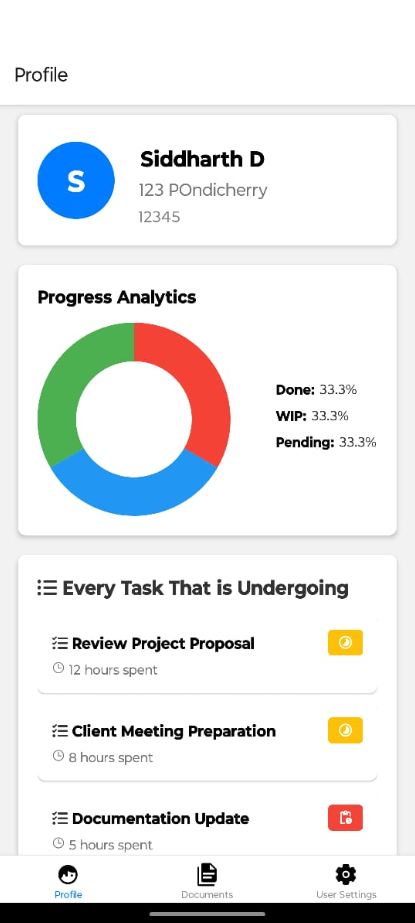
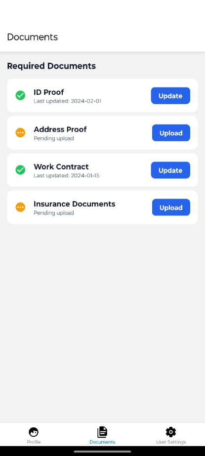
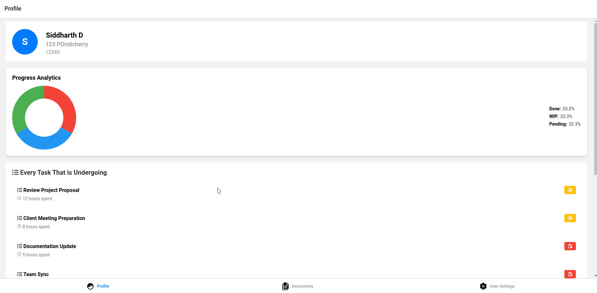
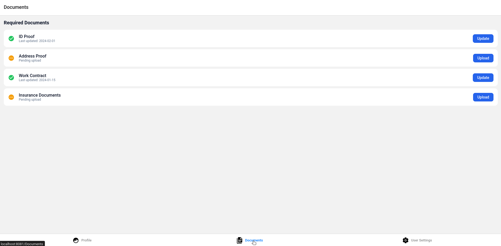
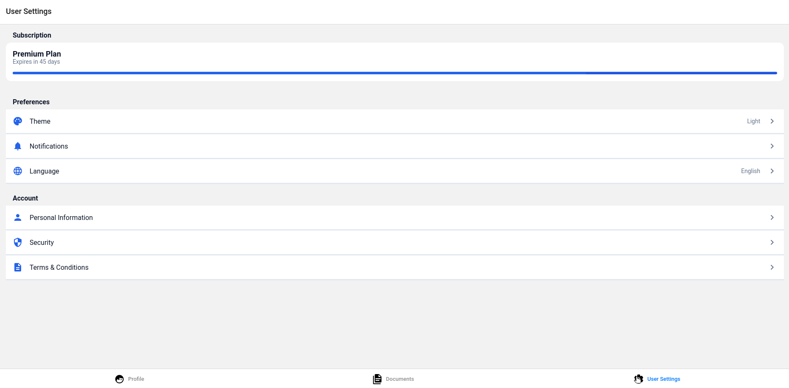

# Safehome

## Commands for the frontend

```
cd frontend
npm install 
npx expo start
```

There is it you got the app going on 

## Some Screenshots 

### Mobile Version






### Desktop Version





